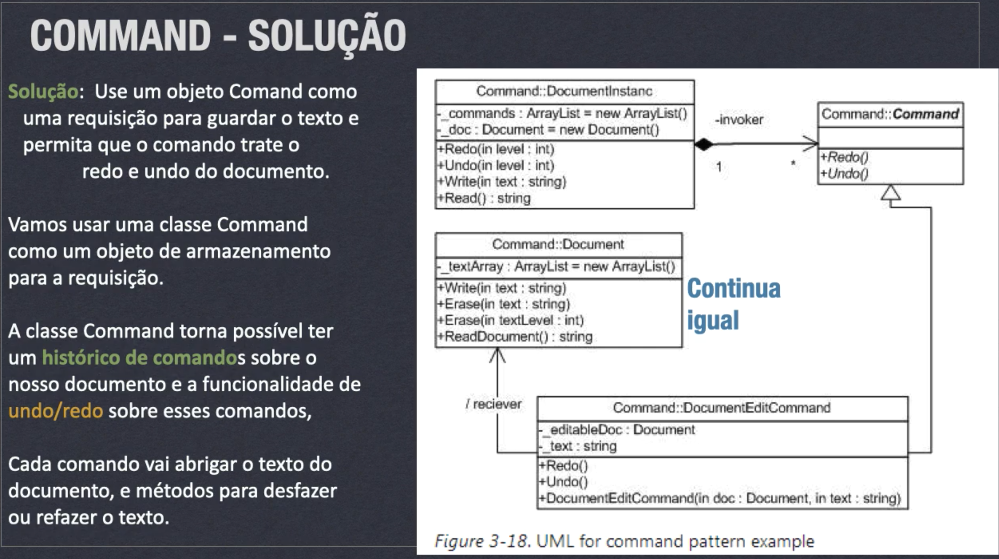
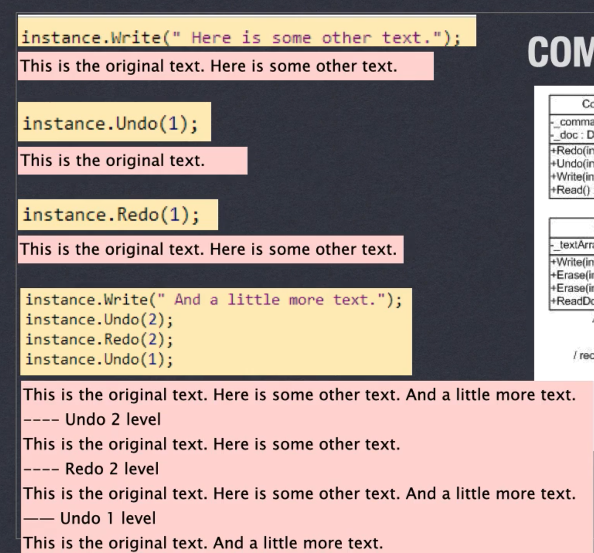
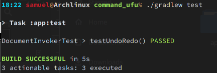

# Design pattern command

## instrução

Implemente completamente o exemplo do editor de texto mostrado na video aula.


## Resposta

Para demonstrar que a minha implementação esta correta foi utilizado o teste do slide:

e implementado o seguinte teste unitário:

```java
//DocumentInvokerTest.java
class DocumentInvokerTest {
    @Test
    void testUndoRedo() {


        String originalText = "This is the original text";
        String someOtherText = " Here is some other text.";
        String littleMoreText = " And a little more text.";
        String fullText = originalText + someOtherText + littleMoreText;

        DocumentInvoker instance = new DocumentInvoker();

        instance.write(originalText);
        instance.write(someOtherText);

        assertEquals(originalText + someOtherText, instance.toString());
        instance.undo(1);
        assertEquals(originalText, instance.toString());

        instance.redo(1);
        assertEquals(originalText + someOtherText, instance.toString());


        instance.write(littleMoreText);
        assertEquals(fullText, instance.toString());

        instance.undo(2);
        assertEquals(originalText + someOtherText, instance.toString());

        instance.redo(2);
        assertEquals(fullText, instance.toString());

        instance.undo(1);
        assertEquals(originalText + littleMoreText, instance.toString());
    }
}
```
E Passei no Teste :)

